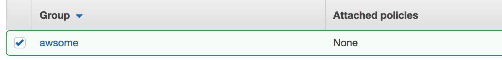

# Get Started With AWSome

Glad you're interested in checking AWSome out. To start making the most of AWSome you will need to have your AWS credentials ready so if you don't have those setup, let's do that before moving on.

If you do have your credentials, that's great. Feel free to just [skip ahead then](#installation).

## AWS Setup

Let's get your AWS account up and running. If you don't have an AWS account, not to worry, this guide will help you set one up, just continue reading.

**STEP 1: Get an AWS Account** (*you may skip this step if you already have an AWS account*)

* So you don't have an AWS Account yet. Not to worry, it takes 5 minutes or less to get one.
* Just go ahead and [create your free AWS account now](https://portal.aws.amazon.com/billing/signup?nc2=h_ct&redirect_url=https%3A%2F%2Faws.amazon.com%2Fregistration-confirmation#/start) and let's continue once you've completed the sign up process.

**STEP 2: Login to your AWS Console**

* AWS has a nice online console that you can access whenever you want to manage your AWS resources.
* So let's go now and [login to your AWS console](https://console.aws.amazon.com/) so we can create a new user.
* Just login with your **email** and **password** that you used to create your account.

**STEP 3: Create a new AWS user**

* We don't always want to access your AWS account with your email and password, because that's not secure, so instead, AWS allows you to create special users that are more secure to use.
* We want to create such a user now, so let's go ahead and [start the New User Wizard](https://console.aws.amazon.com/iam/home?region=us-east-1#/users$new?step=details) and complete it step by step.

* **1. First**, give your user a name (call your user **awsome**).

* **2. Next**, check both check boxes to specify that you want *Programmatic access* and *AWS Management Console access* as well. And let the *Autogenerated password* and the *Require password reset* boxes selected.

* **3. Next**, click the **Next: Permissions** button to go and set some permissions for the new user.

* **4. Next**, click the **Create group** button to create a brand new group for your user.

* **5. Next**, type **awsome** as the name of the group (yeah let's keep it identical to the user name we created in Step 1)

* **6. Next**, click the **Create group** button to finish the process, and don't worry about the policy stuff, just ignore that.

**Woohoo!** Good job, you just create a brand new user with its own group. We will use this user to access your AWS account programmatically.

But first, we have a bit more work to do. Don't worry, this will be quick.

**STEP 4: Create a group policy**

Policies are used in AWS to

## Installation
